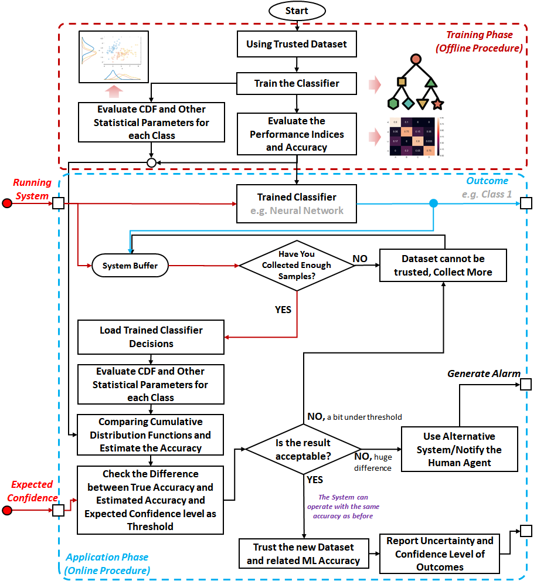

# SafeML

**Runtime safety monitoring for machine learning classifiers using empirical statistical distance measures.**

[](https://github.com/ISorokos/SafeML/blob/master/LICENSE)
[](https://arxiv.org/abs/2005.13166)
[](https://github.com/ISorokos/SafeML)

<div class="hero-actions" markdown>
[Get started](getting-started/index.md){ .md-button .md-button--primary }
[View on GitHub](https://github.com/ISorokos/SafeML){ .md-button }
</div>

## Overview

SafeML is a research project for monitoring whether the operational context of a machine learning classifier remains comparable to its trusted training context. It measures differences between empirical cumulative distribution functions (ECDFs) calculated from trusted and incoming data.

The repository provides Python, MATLAB, and R implementations plus case studies for security datasets, traffic-sign recognition, CIFAR, and synthetic benchmark datasets.

!!! note "Research software"
    SafeML is an experimental research implementation, not a safety certification. Thresholds, buffer sizes, and responses must be validated for the intended system and operating context.

## Key features

<div class="grid cards" markdown>

-   :material-chart-bell-curve: **Distribution monitoring**

    Compare empirical distributions from trusted training data and operational data.

-   :material-ruler: **Multiple distance measures**

    Explore Kolmogorov–Smirnov, Kuiper, Anderson–Darling, Cramér–von Mises, Wasserstein, and related measures implemented in the repository.

-   :material-language-python: **Three implementation languages**

    Use the available Python, MATLAB, and R examples.

-   :material-shield-search: **Safety and security studies**

    Review examples involving intrusion detection, traffic signs, image classification, and synthetic datasets.

</div>

## How SafeML works

| Phase | Data | Purpose |
| --- | --- | --- |
| Training | Trusted, labelled data | Train the classifier and store reference statistical characteristics for each class. |
| Application | Incoming, initially unlabelled data | Compute comparable statistics using predicted classes and measure their distance from the reference. |
| Response | Distance and configured thresholds | Continue, collect more data and re-evaluate, or invoke an alternative response such as human review. |



## Installation

Install the published Python package:

```bash
python -m pip install SafeML
```

For repository examples in MATLAB and R, clone the project and consult the language-specific directories.

## Quick start

The Python package exposes measures through their modules:

```python
from SafeML.Kolmogorov_Smirnov_Distance import Kolmogorov_Smirnov_Dist

trusted = [0.1, 0.2, 0.3, 0.4]
observed = [0.15, 0.25, 0.35, 0.45]

distance = Kolmogorov_Smirnov_Dist(trusted, observed)
print(distance)
```

See the [Quick Start](getting-started/quick-start.md) and [API Reference](reference/api.md) for the functions present in the package.

## Explore with AI

Ask an assistant to explain SafeML, its method, and this documentation:

[Open in ChatGPT](https://chatgpt.com/?q=Explain%20the%20SafeML%20project%20and%20its%20documentation%20at%20https%3A%2F%2Fsafeml.readthedocs.io%2Fen%2Flatest%2F.%20Summarize%20the%20method%2C%20show%20a%20Python%20example%2C%20and%20state%20its%20limitations.){ .md-button }
[Open in Claude](https://claude.ai/new?q=Explain%20the%20SafeML%20project%20and%20its%20documentation%20at%20https%3A%2F%2Fsafeml.readthedocs.io%2Fen%2Flatest%2F.%20Summarize%20the%20method%2C%20show%20a%20Python%20example%2C%20and%20state%20its%20limitations.){ .md-button }
[Open in Gemini](https://gemini.google.com/app?text=Explain%20the%20SafeML%20project%20and%20its%20documentation%20at%20https%3A%2F%2Fsafeml.readthedocs.io%2Fen%2Flatest%2F.%20Summarize%20the%20method%2C%20show%20a%20Python%20example%2C%20and%20state%20its%20limitations.){ .md-button }
[Open in Kimi](https://www.kimi.com/?q=Explain%20the%20SafeML%20project%20and%20its%20documentation%20at%20https%3A%2F%2Fsafeml.readthedocs.io%2Fen%2Flatest%2F.%20Summarize%20the%20method%2C%20show%20a%20Python%20example%2C%20and%20state%20its%20limitations.){ .md-button }

## Citation

If SafeML supports your research, cite the original paper. A ready-to-copy BibTeX entry is available on the [Citation](project/citation.md) page.
